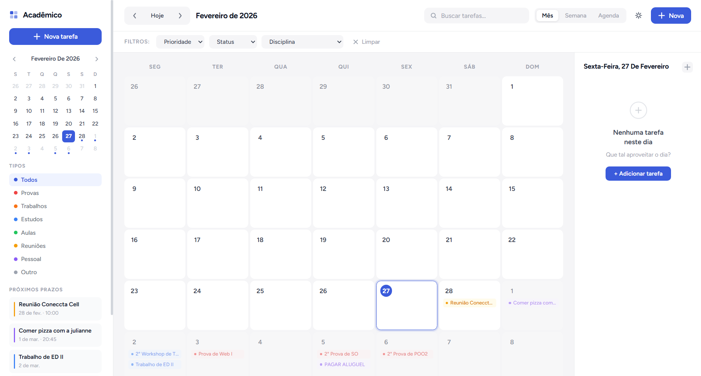

# Academico - Calendario & Tarefas

[](./README.md)
[](./README.md)
[](./README.md)

Aplicacao web para organizacao academica com calendario interativo, painel de tarefas, filtros, tema escuro e recorrencia semanal.

> Projeto sem framework, sem build e sem dependencias externas.  
> Basta abrir `index.html` no navegador.

## Demo e Preview

- Aplicacao online: https://cronograma-academico.netlify.app/



## Sumario

1. [Demo e Preview](#demo-e-preview)
2. [Sobre](#sobre)
3. [Destaques](#destaques)
4. [Arquitetura](#arquitetura)
5. [Estrutura do Projeto](#estrutura-do-projeto)
6. [Como Executar](#como-executar)
7. [Persistencia Local](#persistencia-local)
8. [Modelo de Dados](#modelo-de-dados)
9. [UX Mobile](#ux-mobile)
10. [Roadmap](#roadmap)
11. [Contribuicao](#contribuicao)
12. [Checklist de Qualidade](#checklist-de-qualidade)

## Sobre

O Academico foi desenhado para centralizar a rotina de estudos em uma interface limpa, rapida e direta:

- Visualizacao por Mes, Semana e Agenda
- Cadastro e acompanhamento de tarefas por tipo, prioridade e status
- Busca textual e filtros compostos
- Persistencia local com `localStorage`

## Destaques

- Tema claro/escuro com suporte a preferencia do sistema (`prefers-color-scheme`)
- Recorrencia semanal para criar multiplas ocorrencias em lote
- Indicador de tarefa recorrente nos cards de Agenda e Painel do Dia
- Painel do dia adaptado para mobile com estado expandido/minimizado
- FAB contextual no mobile (aparece no estado minimizado do painel)
- Acessibilidade com `aria-label`, foco visivel e navegacao por teclado

## Arquitetura

O JavaScript segue a organizacao:

1. `state`
2. `utils`
3. `render`
4. `handlers`
5. `storage`
6. `init`

Beneficios:

- Separacao clara de responsabilidades
- Evolucao incremental sem acoplamento desnecessario
- Leitura rapida para manutencao e debug

## Estrutura do Projeto

```text
CRONOGRAMA/
|- index.html
|- style.css
|- script.js
`- README.md
```

## Como Executar

### Opcao 1 - direto no navegador

1. Abra o arquivo `index.html`.

### Opcao 2 - servidor local (recomendado)

```bash
python -m http.server 5500
```

Abra:

```text
http://localhost:5500
```

## Persistencia Local

Chaves utilizadas no `localStorage`:

- `academico_calendar_tasks`
- `academico_theme`

Para resetar os dados:

1. Abra DevTools
2. Va em `Application` > `Local Storage`
3. Remova as chaves acima

## Modelo de Dados

Estrutura principal de tarefa:

```json
{
  "id": "string",
  "titulo": "string",
  "descricao": "string",
  "data": "YYYY-MM-DD",
  "hora": "HH:mm",
  "tipo": "prova|trabalho|estudo|aula|reuniao|pessoal|outro",
  "prioridade": "alta|media|baixa",
  "status": "pendente|concluida",
  "disciplina": "string",
  "recorrencia": "nenhuma|semanal",
  "recorrenciaSemanas": 4,
  "recurrenceGroupId": "string|null",
  "createdAt": "ISO string",
  "updatedAt": "ISO string"
}
```

## UX Mobile

Comportamentos especificos para telas pequenas:

- Sidebar em drawer
- Toggle de visualizacao na sidebar
- Painel do dia com controle de minimizar/expandir
- FAB condicionado ao estado minimizado do painel
- Modal em formato bottom sheet

## Roadmap

### Entregue

- [x] Calendario mensal/semanal/agenda
- [x] CRUD de tarefas completo
- [x] Filtros e busca
- [x] Tema escuro com persistencia
- [x] Recorrencia semanal com `recurrenceGroupId`
- [x] Responsividade desktop/tablet/mobile

### Proximas melhorias

- [ ] Edicao em lote por grupo de recorrencia
- [ ] Importacao/exportacao JSON com UI
- [ ] Drag and drop entre dias no calendario
- [ ] Notificacoes de prazo (PWA/local notifications)
- [ ] Testes automatizados para regras de data e recorrencia

## Contribuicao

Contribuicoes sao bem-vindas. Fluxo sugerido:

1. Crie uma branch
2. Implemente a mudanca com foco em simplicidade
3. Mantenha padrao visual e arquitetura atual
4. Valide comportamento em desktop e mobile
5. Abra PR com descricao objetiva do impacto

Padroes importantes do projeto:

- Sem frameworks JS/CSS
- Sem variaveis CSS
- Sem dependencias externas novas
- Manter a organizacao por secoes no `style.css`
- Manter arquitetura do `script.js` (state -> utils -> render -> handlers -> storage -> init)

## Checklist de Qualidade

- [x] Sem build step
- [x] Sem dependencia externa de runtime
- [x] Persistencia local funcionando
- [x] Tema claro/escuro funcional
- [x] Recorrencia semanal funcional
- [x] Interface responsiva
- [x] Foco em acessibilidade basica
